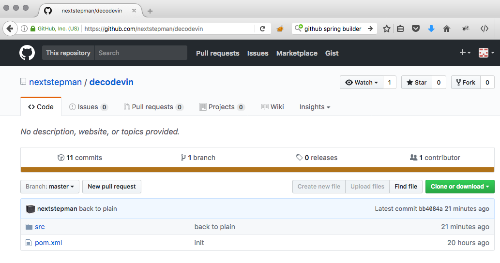
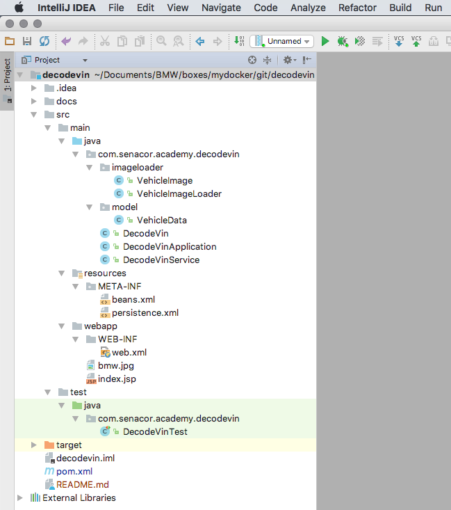
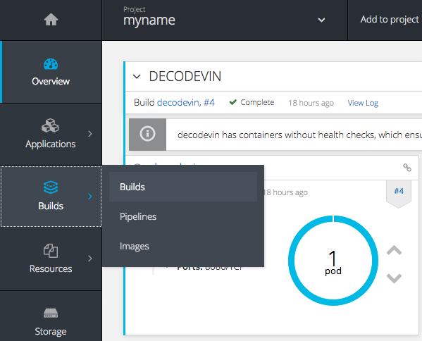
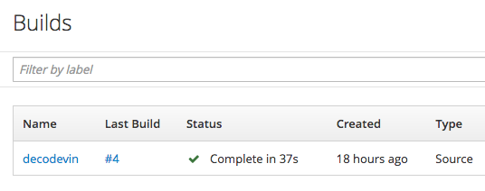
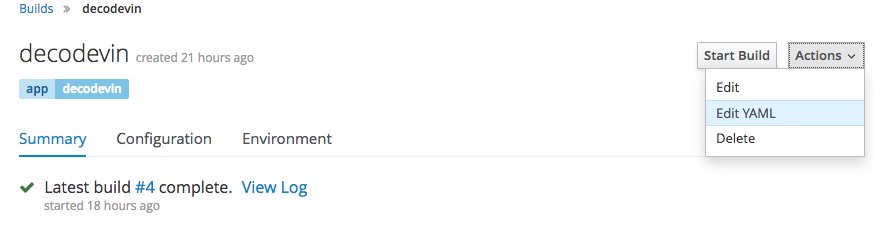
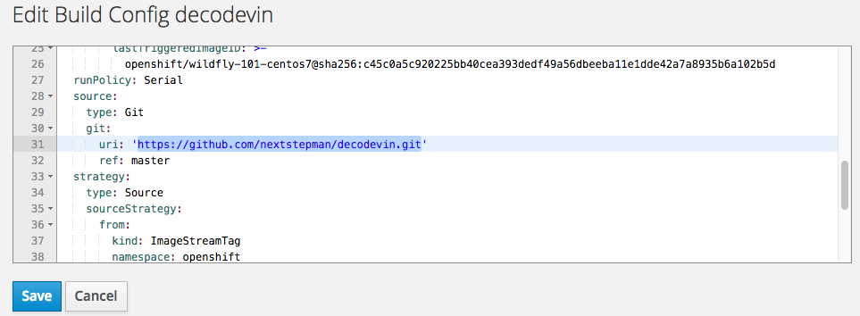

# Exercise No. 1 - Implement

## Overview of this Exercise

The goal of this exercise is to show you how to develop for Openshift. 

As a practical example, you will implement a small code block as part of the provided source code, which will decode some data from a VIN. We will cheat a bit here, as time is short. 

If you want to know more about VINs, see for example [Wikipedia](https://en.wikipedia.org/wiki/Vehicle_identification_number), but don't go there as this page shows all you need to know. 

### Cheating

If time is short, or if you just don't get it to work, you can cheat by using the prepared reference solution.

There is a branch `example1_refsol` in the repository `https://github.com/nextstepman/decodevin.git`. Simply update your BuildConfig like described in Step 5 and continue with this. 

## Step 1: Download the sources

First make a fork of the sources. Go to github, login (or sign up if you don't have one). 

Open the [decodevin](https://github.com/nextstepman/decodevin) repository.

It should look like this:



Click on Fork.

Now you should have a copy of the repository. 

Now clone your repository:

```
git clone <url>
```

and open it as new project in your IDE. 

It is a plain java with maven build project, using Java 8. It contains a web application based on JEE.

It should look like this (if you use IntelliJ). If you use Eclipse, you might need to do some additional steps to get proper maven integration. 



Use maven to build it. It should build successfully. 

## Step 2: Activate the JUnit Test

As it is good practice to develop in a test first manner, lets start with a test. There is one prepared already, which by default is switched off. 

Open the class `DecodeVinTest` and remove the `@Ignore` annotations. 

Build again - now the tests should fail. 

## Step 3: Fix the implementation

Open the class `DecodeVin`

Now we will cheat a bit. There is source code commented out. Comment it in. 

Rerun the Test. Now it should work fine.

## Step 4: Commit and Push

Commit and push your changes to git.

Your repository will be public. This is because it is a fork of a public repository. We keep it public, as a) it does not contain any fancy or secret stuff and b) because it makes it more easy to use it in Openshift as we don't need to bother with credentials. 

## Step 5: Change the BuildConfig to use your project

Open the Openshift Console, navigate to the Overview if not there already, and open the Builds section like shown in the following screen shot:



You should get this screen:



Click on `decodevin`.

You get a screen like the following. 



Click "Actions / Edit YAML" like shown there.

Find this section and update the git url to use yours.



Click `Save`. This will close the screen.

Click `Start Build`

Head back to the Overview and wait until the build and deployment is complete. In case of errors have a look at the build or deployment logs. 

## Step 6: Verify

Open the decodevin service URL like shown in the getting started section. It now should calculate the data correctly:

```
{"wmi":"WVW","year":1998,"vds":"ZZZ3BZ","vis":"WE689725","image":null}
```

Note that the image is still null. This is because we did not connect and fill the database correctly. This will be done in Exercise 2.

## Things to try

Finished already? Try out the following things:

* Scale up the Pods to two instances and build again. Have a look what happens. This is a "Zero Downtime" Deployment. 
* Login to the Pod with the terminal (you find that in the Pod / Terminal) section. Kill the java process. See what happens. This is "Self Healing". 
